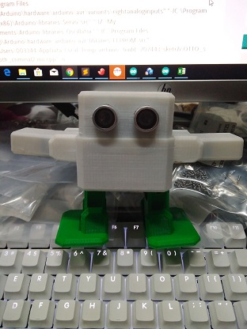

# otto-2-plus

[otto](https://www.ottodiy.com/)是开源的arduino机器人项目,otto-2-plus是我改用ServoTimer2库的实现，避免了用315M、433M模块做遥控时使用VirtualWire库的冲突
- 外壳使用3D打印而成
- 主控板采用arduino nano
- 使用6个sg90舵机控制运动,比otto多了两只手
- 连接了超声波传感器可以测距（代码还没加上）
- 连接有蜂鸣器可以发出简单频率的声音
- 成本低廉，120元左右，是广大电子、机器人爱好者非常合适的一个机器人项目
- 还可以添加更多的硬件实现更多功能（To Do：添加无线模块让它支持无线遥控）

欢迎更改代码来让otto-2-plus按照你的指令运行
说明:主要函数在otto-2-plus.ino里,核心文件是Otto2p.cpp和Otto2p.h,主要直接沿用的otto的代码,暂未添加手部的动作
